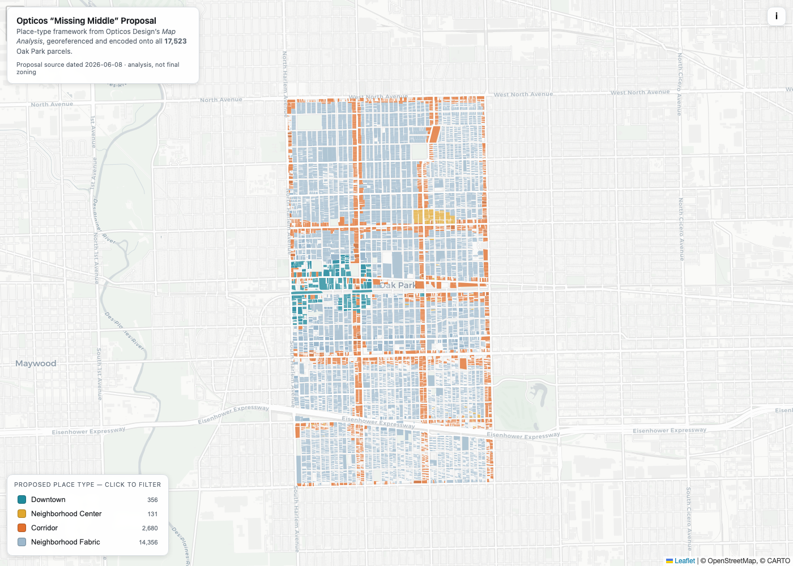

# Oak Park — Opticos “Missing Middle” Proposal over Parcels

An interactive map that overlays Opticos Design’s proposed **Place Types**
framework (from the Shape Oak Park rezoning effort) onto every parcel in
Oak Park, IL. Each of the ~17,500 parcels is tagged with the place type that
covers it, so you can see — parcel by parcel — where the proposal points toward
downtown-intensity, neighborhood-center, corridor, and neighborhood-fabric
treatment.

**🔗 Live site:** _(added after first Pages deploy — see below)_



## What it shows

| Place type | Meaning in the proposal |
|---|---|
| **Downtown** | Highest-intensity core (Lake/Marion area) |
| **Neighborhood Center** | Higher-intensity business nodes |
| **Corridor** | Parcels fronting a designated corridor street |
| **Neighborhood Fabric** | The rest of Oak Park — where “missing middle everywhere” applies (~82% of parcels) |

Click any parcel for its PIN, address, class, place type, and a link to the
Cook County Assessor record. Legend swatches filter the map.

## ⚠️ Important caveat

This encodes Opticos’s **existing-conditions / framework** map (the *Place Types
& Transit* sheet of the June 2026 “Map Analysis”), **not** the final
parcel-level proposed zoning map — which was expected around the **2026-07-28**
Village Board vote. Treat place types as a proxy for proposed intensity, not as
adopted zoning.

## How it was built

1. **Georeference** — the Opticos Place Types map (a 24×36″ InDesign PDF poster)
   was pinned to WGS84 using Oak Park’s street grid as ground control
   (8 E-W streets × 7 N-S avenues from OpenStreetMap), yielding a north-up
   affine fit at **~10–15 m RMS** accuracy (isotropic 0.95 m/px).
2. **Classify** — each raster pixel is classified by color into Downtown (teal),
   Neighborhood Center (yellow), Corridor (orange lines), and commercial
   footprints (dark red).
3. **Encode** — parcels are rasterized in the same grid; each parcel gets the
   dominant place type over its footprint (Neighborhood Fabric is the default;
   Corridor is assigned by frontage adjacency to a corridor line).
   See [`encode_proposal.py`](encode_proposal.py).

Output: [`parcels_proposal.geojson`](parcels_proposal.geojson) — the parcel layer
with added `place_type` and `commercial_bldg` properties.

## Data sources

- **Parcels:** Cook County GIS parcel polygons (via
  [oak-park-properties](https://github.com/jvanderberg/oak-park-properties)),
  WGS84, PIN-keyed.
- **Proposal:** Opticos Design “Map Analysis,” from
  [Shape Oak Park documents](https://engageoakpark.com/shape/documents).

## Run locally

```sh
python3 -m http.server 8000   # then open http://localhost:8000
```

Static site — no build step, no backend. Basemap tiles from CARTO/OpenStreetMap.
